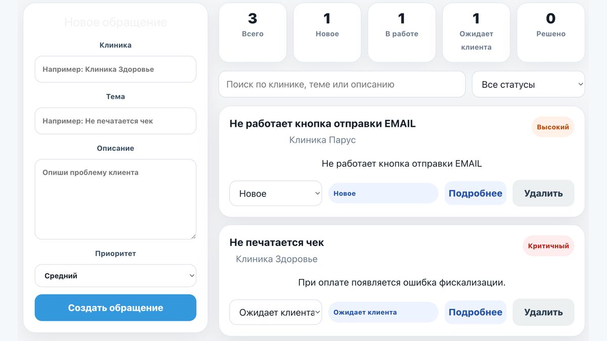
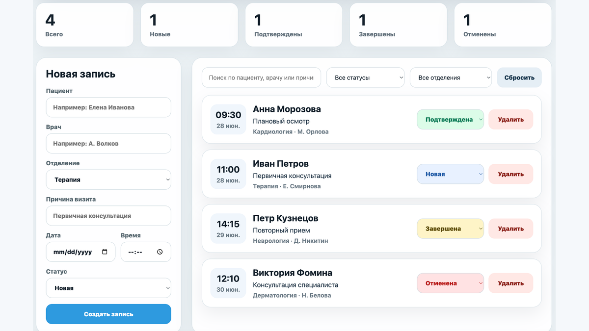
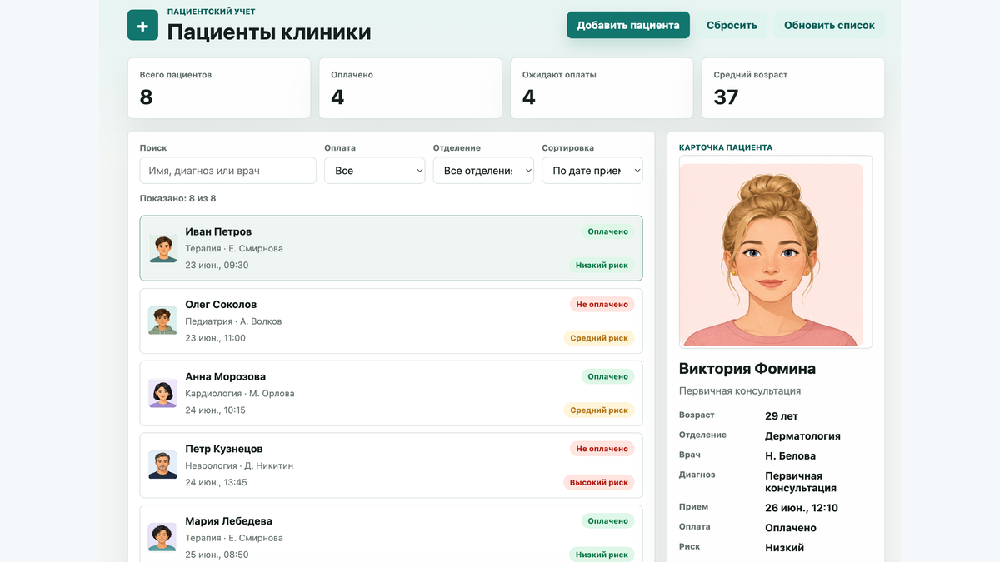

<h1 align="center">Hi, I'm Ernest 👋</h1>

<p align="center">
  
</p>

<p align="center">
  <a href="mailto:mega.ernest13@gmail.com">
    
  </a>
  <a href="https://github.com/MrSSStrange">
    
  </a>
  <a href="https://www.linkedin.com/in/ernest-muzafarov-919a323a2/">
    
  </a>
</p>

---

## 🇺🇸 About

I am a frontend developer with a strong technical support leadership background.

Currently, I lead a technical support team at **GIASOFT**, where I work with medical information systems, client workflows, integrations, technical documentation, product issues and real business processes.

This experience helps me build frontend interfaces that are not just visually clean, but also practical, structured and useful for real users.

I focus on **React**, **TypeScript**, **JavaScript**, dashboards, forms, filters, status management and internal tools.

---

## 🧰 Tech Stack

<p align="center">
  
</p>

<p align="center">
  
  
  
  
  
  
  
</p>

---

## 🚀 Featured Projects

<table>
  <tr>
    <td width="50%">
      
      <h3>⭐ Ernest SupportDesk</h3>
      <p>
        React TypeScript support desk app for managing client requests, ticket statuses, priorities and internal workflow.
      </p>
      <p>
        <b>Stack:</b> React, TypeScript, Vite
      </p>
      <p>
        <b>Highlights:</b> ticket management, priority control, search, filters, status workflow and dashboard statistics.
      </p>
      <p>
        <a href="https://mrssstrange.github.io/ernest-supportdesk/">Demo</a> •
        <a href="https://github.com/MrSSStrange/ernest-supportdesk">Code</a>
      </p>
    </td>
    <td width="50%">
      
      <h3>⭐ Clinic Appointments Dashboard</h3>
      <p>
        React TypeScript dashboard for managing clinic appointments, doctors, patients and visit statuses.
      </p>
      <p>
        <b>Stack:</b> React, TypeScript, Vite, LocalStorage
      </p>
      <p>
        <b>Highlights:</b> appointment creation, search, filters, status management, statistics and local data storage.
      </p>
      <p>
        <a href="https://mrssstrange.github.io/clinic-appointments-dashboard/">Demo</a> •
        <a href="https://github.com/MrSSStrange/clinic-appointments-dashboard">Code</a>
      </p>
    </td>
  </tr>
  <tr>
    <td width="50%">
      
      <h3>⭐ Clinic Patients</h3>
      <p>
        JavaScript patient management app with forms, validation, search, filters and dynamic DOM rendering.
      </p>
      <p>
        <b>Stack:</b> HTML, CSS, JavaScript, DOM, LocalStorage
      </p>
      <p>
        <b>Highlights:</b> patient cards, form validation, photo upload, filtering, sorting and browser storage.
      </p>
      <p>
        <a href="https://mrssstrange.github.io/clinic-patients/">Demo</a> •
        <a href="https://github.com/MrSSStrange/clinic-patients">Code</a>
      </p>
    </td>
    <td width="50%">
      <h3>🎯 What I Build</h3>
      <p>
        Practical frontend interfaces based on real business workflows.
      </p>
      <p>
        <b>Focus:</b> dashboards, forms, data lists, filters, status logic, clean UI and user-friendly internal tools.
      </p>
      <p>
        <b>Direction:</b> React, TypeScript, REST API and full-stack fundamentals.
      </p>
    </td>
  </tr>
</table>

---

## 📜 Certificates

<p align="center">
  <a href="./assets/udemy-certificate-english.pdf">
    
  </a>
</p>

<p align="center">
  <b>Udemy Certificate:</b> The Complete JavaScript Course — From Scratch to Results!
</p>

## 🎯 Portfolio Focus

```txt
Frontend development
React + TypeScript
Dashboards and internal tools
Forms and validation
Search, filters and sorting
State and data rendering
Real business workflows
Medical information systems domain
```

---

## 📚 Currently Learning

```txt
Advanced JavaScript
React architecture
TypeScript
REST API
Git and GitHub workflow
Frontend architecture
Clean UI development
Full-stack fundamentals
```

---

## 📊 GitHub Stats

<p align="center">
  
  
</p>

<p align="center">
  
</p>

---

## 🤝 Let's Connect

<p align="center">
  <a href="mailto:mega.ernest13@gmail.com">
    
  </a>
  <a href="https://www.linkedin.com/in/ernest-muzafarov-919a323a2/">
    
  </a>
</p>

---

<p align="center">
  <b>Build clean. Think product. Solve real problems.</b>
</p>


